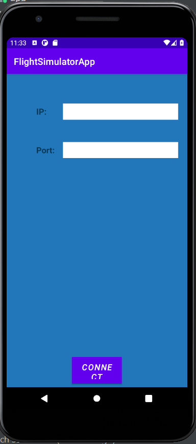
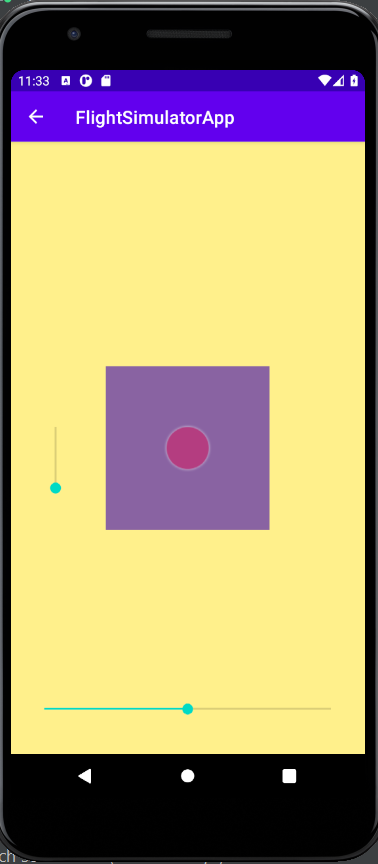

# FlightSimulatorApp

## Main Objectives:
1. Building an android App for Remote Control Joystick.
2. Using FlightGear Simulator with TCP connection.


## Summary

The FlightSimulatorApp is an android app for Remote Control the flight that perform in FlightGear Simulator. 
Using Joystick controls Alieron and Elevator, and seekBar's controling Ruuder and Thorttle.





## Folder Structure

```
.flightSimulatorApp
├── model                 # TCP Client.
├── View                  # Views of the app.
|   ├── JoyStick          # JoyStick settings.
|   ├── JoyStickActivity  # Internal model view from the joystick to the model and view.
├── ModelView
|   ├── MainActivity      # the main that conatin the model and all view's settings.

```
## Compiling and running
1. Clone/download this repo.
2. Open the folder in an IDE like Android Studio.
3. Open the flightGear Simulator, go to Setting and insert '--telnet=socket,in,10,192.168.1.169,6400,tcp' in the Additional Settings.
4. Run the app in your phone or in Android Studio's simulator.
5. Enter your computer's IP and port: 6400, and press the Connect button. 
6. Now you can control the plane.

## Additional Links
- [Short instructional video about the project.](https://www.youtube.com/watch?v=Rtib_R_Ls4Y)
